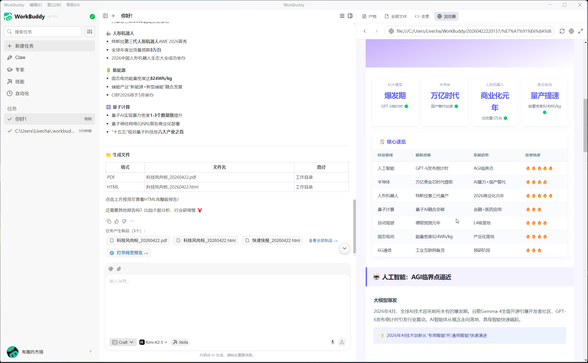
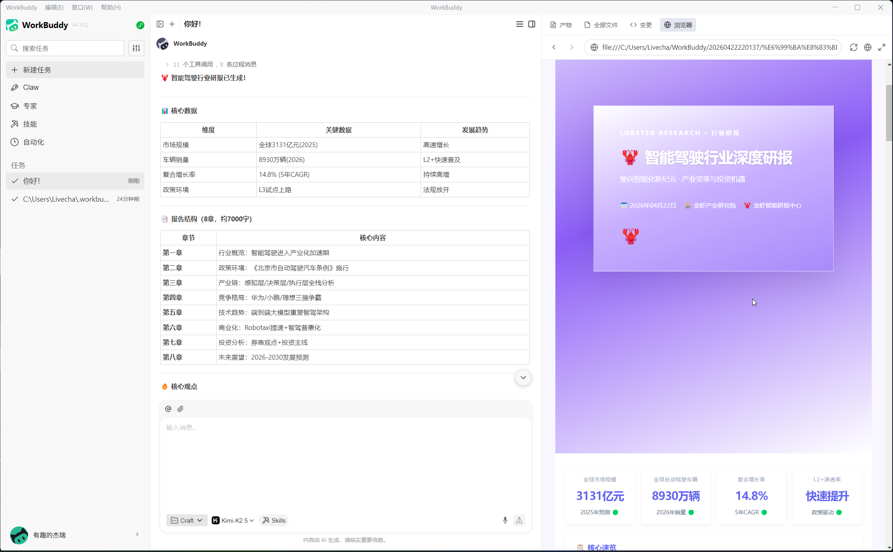

<div align="center">

# 🦞 Lobster Research

**简单易用，功能丰富的 AI 调研助手。**<br>
**Your AI research assistant.**

[](https://www.python.org/)
[](LICENSE)
[]()

</div>

---

## 🌐 语言 / Languages

- [中文](#中文)
- [English](#english)

---

<a id="中文"></a>

## 🇨🇳 中文

### 什么是龙虾调研？

龙虾调研（Lobster Research）是一款 **AI 驱动的智能调研助手**，专为投资者、分析师、研究人员以及任何需要结构化情报的人设计。它将**代码驱动的数据采集**与**AI 智能分析整合**相结合，输出三种格式的专业研究报告：

| 格式     | 说明        | 输出         |
|:------ |:--------- |:---------- |
| **快讯** | 实时市场资讯速览  | 文字回复       |
| **快报** | 简要市场风向速报  | PDF（3-5页）  |
| **研报** | 深度行业/企业研究 | PDF（8-15页） |

**覆盖领域**：23 个领域，涵盖 A股/港股/美股、ETF、大宗商品、期货、跨资产，以及科技、游戏、军事、农业、生物医疗、文化艺术、政治、宇宙地理等 12 个非金融领域。

### 适用场景

- 📈 **股市投资者** — 定时监控大盘行情，快速获取持仓快照，或深度研究个股
- 🔬 **科技关注者** — 追踪技术趋势、AI 突破、前沿研究方向
- 📊 **行业分析师** — 定期收集整理行业动态、政策变化、竞争格局
- 🎓 **学者与研究员** — 生成带引用、数据表格和专业排版的结构化研究报告
- 🗞️ **资讯读者** — 获取市场异动、跨资产流向、地缘事件的简明资讯摘要

无论您是什么背景，直接用自然语言说出需求，系统自动识别并路由。

### 核心特性

- 🎯 **智能 NLP 路由**：自然语言输入 → 双层关键词自动匹配领域和输出类型
- 📊 **多源数据**：新浪财经、腾讯财经、AKShare、证券之星、Tavily/百度/Bing/Serpbase 搜索
- 📝 **28 套报告模板**：7 份快报 + 21 份研报，全部外置可配置
- 🤖 **人机协作**：代码负责确定性数据采集，AI 负责理解性分析整合
- 🎨 **精美 PDF 输出**：多主题样式（iOS 液态 / 蓝色 / 橙色），支持表格和图表
- 🔧 **热更新配置**：所有路由关键词和领域设置放在 `main.json` 中，无需改代码

### 推荐配置

> 本仓库中的所有演示研报均基于以下配置输出，推荐使用以获得最佳效果。

| 组件         | 推荐                                                                                           |
|:---------- |:-------------------------------------------------------------------------------------------- |
| **Agent**  | [WorkBuddy](https://www.workbuddy.ai) — 原生技能支持 + 文件交付                                        |
| **AI 模型**  | [Mimo 2.5](https://mimo.xiaomi.com/) 或 [Kimi 2.5](https://www.kimi.com/) — 中文金融推理能力强，速度与质量均衡 |
| **搜索 API** | [Serpbase](https://serpbase.dev) — 多引擎聚合，JSON 输出稳定可靠                                         |

以上组合用于生成 `showcase/` 中的所有演示报告。其他 Agent 与模型同样兼容，但输出质量可能有所差异。

### 快速开始（Agent 模式）

最简单的方式是直接把仓库链接发给 AI Agent，它会自动 clone 并安装技能。

**WorkBuddy / QClaw / OpenClaw**

把下面这句话直接发给你的 Agent：

```
请帮我安装 Lobster Research 技能：
https://github.com/hegeo/lobster-research.git
```

Agent 会自动完成：

1. `git clone` 仓库到技能目录
2. `pip install -r requirements.txt` 安装所有依赖
3. 加载 `SKILL.md` 作为操作手册，开始处理你的请求

**手动安装（如需）**

```bash
git clone https://github.com/hegeo/lobster-research.git
cd lobster-research
pip install -r requirements.txt

# 可选：配置搜索引擎 API 密钥
cp config/settings.json.example config/settings.json
# 编辑 settings.json，填入 Tavily/Bing 等 API 密钥
```

### 使用方式

**龙虾调研是一款 OpenClaw 兼容的技能。** 它在支持工具调用和文件系统访问的 AI Agent 平台中表现最佳：

| 平台                   | 使用方式                                                                           |
|:-------------------- |:------------------------------------------------------------------------------ |
| **WorkBuddy**        | 作为技能安装。Agent 读取 `SKILL.md`，运行 `main.py smart`，填写 `5_agent_report_input.json`，交付 PDF。 |
| **QClaw / OpenClaw** | 部署技能文件夹。Agent 编排 Phase 1（数据采集）→ Phase 2（内容整合）→ Phase 3（PDF 生成）。                |
| **其他 Agent 框架**      | 任何能执行 Python 脚本、读写 JSON、调用 `deliver_attachments` 的框架均可兼容。                      |

`SKILL.md` 文件是 **Agent 的操作手册** —— 它告诉 AI 每个阶段该做什么、遵守什么规则、如何交付结果。

### 架构设计

```
┌─────────────┐     ┌─────────────────────────────────────────────────────┐
│   用户      │────▶│  Phase 1: 代码驱动数据采集                           │
│   输入      │     │  • 实时行情（新浪/腾讯）                              │
│             │     │  • K线 + 技术指标                                     │
│             │     │  • 个股详细资料                                       │
│             │     │  • 大盘指数                                           │
│             │     │  • 联网搜索（多引擎）                                 │
└─────────────┘     └────────────────────┬────────────────────────────────┘
                                         │ JSON 文件写入 output/tasks/<id>/
                                         ▼
┌─────────────────────────────────────────────────────────────────────────┐
│  Phase 2: AI 整合（Agent 填写 5_agent_report_input.json）                      │
│  • 读取所有 JSON 数据文件                                                 │
│  • 联网搜索补充缺失信息                                                   │
│  • 填写结构化报告内容                                                     │
└────────────────────┬────────────────────────────────────────────────────┘
                     │ 5_agent_report_input.json
                     ▼
┌─────────────────────────────────────────────────────────────────────────┐
│  Phase 3: 代码驱动报告生成                                               │
│  • HTML 渲染（Jinja2 + CSS 主题）                                        │
│  • PDF 转换（OpenClaw browser.pdf）                                      │
│  • 交付用户                                                               │
└─────────────────────────────────────────────────────────────────────────┘
```

### 项目结构

```
lobster-research/
├── main.py              # 入口 + Smart NLP 路由
├── main.json            # 路由配置（领域 + 输出类型）
├── SKILL.md             # Agent 技能指令（AI Agent 的操作手册）
├── scripts/             # 数据采集 & 报告生成
│   ├── task_runner.py   # Phase 1/3 执行引擎
│   ├── ticktime.py      # 实时行情（新浪/腾讯）
│   ├── stock_data_collector.py  # K线 + 技术指标
│   ├── stock_master.py  # 个股详细资料
│   ├── websearch_pro.py # 多引擎搜索（Tavily/百度/Bing/Serpbase）
│   ├── akshare_api_kit.py       # AKShare 结构化数据
│   ├── baidu_dailynews.py       # 新闻头条
│   ├── market_state.py  # 市场情绪（Playwright）
│   ├── parse_image.py   # 持仓截图 OCR
│   ├── generate_report.py       # HTML/PDF 渲染器
│   └── generate_alonemode.py    # Alone 模式：自动调 LLM API
├── config/              # 配置
│   ├── config.py        # 配置管理 + 持仓操作
│   ├── config.json      # 用户偏好
│   ├── portfolio.json   # 持仓数据
│   └── settings.json    # API 密钥
├── prompts/json/        # 28 套报告提示词模板（7 快报 + 21 研报）
├── styles/              # 报告 CSS 主题（blue/orange/ios_liquid）
├── references/          # 参考文档（指南、速查表）
└── output/tasks/        # 任务输出文件夹
```

### 技术栈

| 层级     | 技术                                         |
|:------ |:------------------------------------------ |
| 语言     | Python 3.10+                               |
| 数据源    | 新浪财经、腾讯财经、AKShare、证券之星                     |
| 搜索     | Tavily API、百度搜索、Bing 搜索、Serpbase、ProSearch |
| 网页抓取   | requests、Playwright                        |
| OCR    | easyocr（持仓截图解析）                            |
| 报告渲染   | Jinja2 + 自定义 CSS                           |
| PDF 生成 | OpenClaw browser.pdf()                     |
| 配置格式   | JSON                                       |

### 独立客户端使用 + Alone 模式（内置）

龙虾调研内置 **Alone 模式**，支持不依赖 AI Agent 平台独立运行：

```
skill 模式（默认）：
  Phase 1（代码采集） → Phase 2（AI Agent 读 JSON + 写 5_agent_report_input.json） → Phase 3（代码生成）

alone 模式：
  Phase 1（代码采集） → Phase 2（自动调 LLM API → 写 5_agent_report_input.json） → Phase 3（代码生成）
```

在 `alone` 模式下，Phase 2 自动通过 `generate_alonemode.py` 调用 OpenAI 兼容接口：
- 支持 Kimi / Mimo / DeepSeek 等 LLM（配置在 settings.json 的 apis 段）
- 优先使用工具调用（function calling）写入 `5_agent_report_input.json`
- 无工具调用能力时降级为纯 Markdown 输出
- `cli` 模式 → stdout 纯文本；`report` 模式 → 生成 HTML + PDF

```powershell
# 启用 alone 模式
python config/config.py set system.run_mode alone
python config/config.py set alone.output_mode report   # 或 cli
python config/config.py settings set apis.kimi_api_key sk-xxx

# 使用（与 skill 模式相同）
python main.py smart --input "快速选股研报"
```

### 命令参考（开发者）

```bash
# Smart 模式 — 自然语言自动路由
python main.py smart --input "大盘今日行情"
python main.py smart --input "新能源汽车行业研报"
python main.py smart --input "分析我的持仓"

# 直接命令
python main.py stock --code 000063 --name 中兴通讯
python main.py company --code 000063 --name 中兴通讯
python main.py market
python main.py industry --topic AI芯片
python main.py screener --topic 机器人
python main.py portfolio --file portfolio.json

# 生命周期
python main.py generate --task-id 20260505_143022
python main.py status --task-id 20260505_143022
python main.py list
```

### 案例展示

> 更多实机运行截图和研报案例 PDF 文件在本仓库的 `showcase/` 目录内。

<div align="center">
  
  
</div>

### 本地化

想要将龙虾调研适配到您所在的本地市场？请参阅 **[LOCALIZATION.md](LOCALIZATION.md)** 获取分步指南。

### 开源协议

MIT License — 详见 [LICENSE](LICENSE)。

---

<div align="center">

如果本项目对你有所帮助，请不要吝啬你的 ⭐ **Star** ～<br>
你的关注和支持是我们持续优化最大的动力！

</div>

---

<a id="english"></a>

## 🇺🇸 English

### What is Lobster Research?

Lobster Research is an **AI-powered financial research report generator** designed for investors, analysts, researchers, and anyone who needs structured intelligence. It combines **code-driven data collection** with **AI-powered content synthesis** to produce professional-grade research reports in three formats:

| Format            | Description                        | Output           |
|:----------------- |:---------------------------------- |:---------------- |
| **News Flash**    | Real-time market news digest       | Text reply       |
| **Quick Report**  | Brief market intelligence summary  | PDF (3-5 pages)  |
| **Deep Research** | In-depth industry/company analysis | PDF (8-15 pages) |

**Coverage**: 23 domains including A-shares, H-shares, US stocks, ETFs, commodities, futures, cross-assets, and 12 non-financial sectors (tech, gaming, military, agriculture, biotech, culture, politics, space, etc.)

### Who is it for?

- 📈 **Stock investors** — Schedule daily market monitoring, get quick portfolio snapshots, or request deep dives into individual stocks
- 🔬 **Tech watchers** — Track technology trends, AI breakthroughs, and frontier research directions
- 📊 **Industry analysts** — Collect and organize sector dynamics, policy changes, and competitive landscapes on a regular basis
- 🎓 **Researchers & scholars** — Generate structured research reports with citations, data tables, and professional formatting
- 🗞️ **News readers** — Get concise news briefs on market movements, cross-asset flows, or geopolitical events

No matter your background, just speak naturally. The system routes your request automatically.

### Key Features

- 🎯 **Smart NLP Routing**: Natural language input → automatic domain + output-type matching via dual-layer keyword system
- 📊 **Multi-Source Data**: Sina Finance, Tencent Finance, AKShare, Securities Star, Tavily/Baidu/Bing/Serpbase search
- 📝 **28 Report Templates**: 7 Quick Reports + 21 Deep Research reports, all externally configurable
- 🤖 **Human-AI Collaboration**: Code handles deterministic data collection; AI handles analytical synthesis
- 🎨 **Beautiful PDF Output**: Multiple themes (iOS Liquid / Blue / Orange) with table and chart support
- 🔧 **Hot-Reload Config**: All routing keywords and domain settings live in `main.json` — no code changes needed

### Recommended Setup

> The showcase reports in this repository were generated using the following configuration. We recommend it for the best experience.

| Component      | Recommendation                                                                                                                    |
|:-------------- |:--------------------------------------------------------------------------------------------------------------------------------- |
| **Agent**      | [WorkBuddy](https://www.workbuddy.ai) — native skill support + file delivery                                                      |
| **AI Model**   | [Mimo 2.5](https://mimo.xiaomi.com/) or [Kimi 2.5](https://www.kimi.com/) — best balance of Chinese financial reasoning and speed |
| **Search API** | [Serpbase](https://serpbase.dev) — reliable multi-engine search with JSON output                                                  |

These combinations were used to produce all demo reports in `showcase/`. Other agents and models will also work, but output quality may vary.

### Quick Start (Agent Mode)

The easiest way to get started is to hand the repository URL directly to your AI Agent — it will clone the repo and install the skill automatically.

**WorkBuddy / QClaw / OpenClaw**

Just paste this message to your Agent:

```
Please install the Lobster Research skill from:
https://github.com/hegeo/lobster-research.git
```

The Agent will:

1. `git clone` the repository into the skills directory
2. `pip install -r requirements.txt` to install all dependencies
3. Load `SKILL.md` as the operating manual and start handling your requests

**Manual setup (if needed)**

```bash
git clone https://github.com/hegeo/lobster-research.git
cd lobster-research
pip install -r requirements.txt

# Optional: configure API keys for search engines
cp config/settings.json.example config/settings.json
# Edit settings.json with your Tavily/Bing API keys
```

### How to Use It

**Lobster Research is designed as an OpenClaw-compatible skill.** It works best within AI Agent platforms that support tool calling and file system access:

| Platform                   | How to Use                                                                                                                          |
|:-------------------------- |:----------------------------------------------------------------------------------------------------------------------------------- |
| **WorkBuddy**              | Install as a skill. The Agent reads `SKILL.md`, runs `main.py smart`, fills `5_agent_report_input.json`, and delivers the PDF.            |
| **QClaw / OpenClaw**       | Deploy the skill folder. The Agent orchestrates Phase 1 (data collection) → Phase 2 (content synthesis) → Phase 3 (PDF generation). |
| **Other Agent frameworks** | Any framework that can execute Python scripts, read/write JSON, and call `deliver_attachments` is compatible.                       |

The `SKILL.md` file serves as the **Agent instruction manual** — it tells the AI exactly what to do at each phase, what rules to follow, and how to deliver results.

### Architecture

```
┌─────────────┐     ┌─────────────────────────────────────────────────────┐
│   User      │────▶│  Phase 1: Code-Driven Data Collection               │
│   Input     │     │  • Real-time quotes (Sina/Tencent)                  │
│             │     │  • K-line + technical indicators                    │
│             │     │  • Individual stock profiles                          │
│             │     │  • Market indices                                     │
│             │     │  • Web search (multi-engine)                          │
└─────────────┘     └────────────────────┬────────────────────────────────┘
                                         │ JSON files in output/tasks/<id>/
                                         ▼
┌─────────────────────────────────────────────────────────────────────────┐
│  Phase 2: AI Integration (Agent fills 5_agent_report_input.json)              │
│  • Read all JSON data files                                             │
│  • Supplement with additional web search                                │
│  • Fill structured report content                                       │
└────────────────────┬────────────────────────────────────────────────────┘
                     │ 5_agent_report_input.json
                     ▼
┌─────────────────────────────────────────────────────────────────────────┐
│  Phase 3: Code-Driven Report Generation                                 │
│  • HTML rendering (Jinja2 + CSS themes)                                 │
│  • PDF conversion (OpenClaw browser.pdf)                                │
│  • Deliver to user                                                      │
└─────────────────────────────────────────────────────────────────────────┘
```

### Project Structure

```
lobster-research/
├── main.py              # Entry point + Smart NLP router
├── main.json            # Routing config (domains + output types)
├── SKILL.md             # Agent skill instructions (THE manual for AI Agents)
├── scripts/             # Data collection & report generation
│   ├── task_runner.py   # Phase 1/3 execution engine
│   ├── ticktime.py      # Real-time quotes (Sina/Tencent)
│   ├── stock_data_collector.py  # K-line + technicals
│   ├── stock_master.py  # Individual stock profiles
│   ├── websearch_pro.py # Multi-engine search (Tavily/Baidu/Bing/Serpbase)
│   ├── akshare_api_kit.py       # AKShare structured data
│   ├── baidu_dailynews.py       # News headlines
│   ├── market_state.py  # Market sentiment (Playwright)
│   ├── parse_image.py   # Portfolio screenshot OCR
│   ├── generate_report.py       # HTML/PDF renderer
│   └── generate_alonemode.py    # Alone mode: auto LLM API call
├── config/              # Configuration
│   ├── config.py        # Settings manager + portfolio operations
│   ├── config.json      # User preferences
│   ├── portfolio.json   # Portfolio holdings
│   └── settings.json    # API keys
├── prompts/json/        # 28 report prompt templates (7 quick + 21 deep)
├── styles/              # Report CSS themes (blue/orange/ios_liquid)
├── references/          # Reference docs (guides, cheatsheets)
└── output/tasks/        # Task output folders
```

### Tech Stack

| Layer            | Technology                                                 |
|:---------------- |:---------------------------------------------------------- |
| Language         | Python 3.10+                                               |
| Data Sources     | Sina Finance, Tencent Finance, AKShare, Securities Star    |
| Search           | Tavily API, Baidu Search, Bing Search, Serpbase, ProSearch |
| Web Scraping     | requests, Playwright                                       |
| OCR              | easyocr (portfolio screenshot parsing)                     |
| Report Rendering | Jinja2 + custom CSS                                        |
| PDF Generation   | OpenClaw browser.pdf()                                     |
| Config Format    | JSON                                                       |

### Standalone Mode / Alone Mode (Built-in)

Lobster Research has a built-in **Alone Mode** that works without an AI Agent platform:

```
skill mode (default):
  Phase 1 (data collection) → Phase 2 (AI Agent reads JSON + writes 5_agent_report_input.json) → Phase 3 (report generation)

alone mode:
  Phase 1 (data collection) → Phase 2 (auto LLM API → writes 5_agent_report_input.json) → Phase 3 (report generation)
```

In `alone` mode, Phase 2 calls OpenAI-compatible LLM APIs through `generate_alonemode.py`:
- Supports Kimi / Mimo / DeepSeek (configured in settings.json apis section)
- Prioritizes function calling to write `5_agent_report_input.json`
- Falls back to pure Markdown output if tool calling is not available
- `cli` output → stdout text; `report` output → HTML + PDF files

### CLI Commands (for developers)

```bash
# Smart mode — natural language routing
python main.py smart --input "大盘今日行情"
python main.py smart --input "新能源汽车行业研报"
python main.py smart --input "分析我的持仓"

# Direct commands
python main.py stock --code 000063 --name 中兴通讯
python main.py company --code 000063 --name 中兴通讯
python main.py market
python main.py industry --topic AI芯片
python main.py screener --topic 机器人
python main.py portfolio --file portfolio.json

# Lifecycle
python main.py generate --task-id 20260505_143022
python main.py status --task-id 20260505_143022
python main.py list
```

### Showcase

> More screenshots and sample report PDFs are available in the `showcase/` directory.

<div align="center">
  
  
</div>

### Localization

Want to adapt Lobster Research for your local market? See **[LOCALIZATION.md](LOCALIZATION.md)** for a step-by-step guide.

### License

MIT License — see [LICENSE](LICENSE) for details.

---

<div align="center">

If you find this project helpful, please give it a ⭐ **Star**!<br>
Your support is what keeps us improving.

</div>

---

<div align="center">

_架构理念：代码处理确定性任务，Agent 处理理解性任务_<br>
_Architecture philosophy: Code handles deterministic tasks; Agent handles understanding tasks_

</div>
